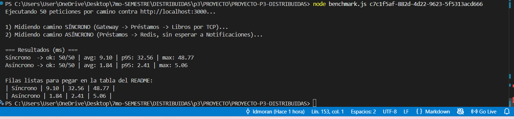
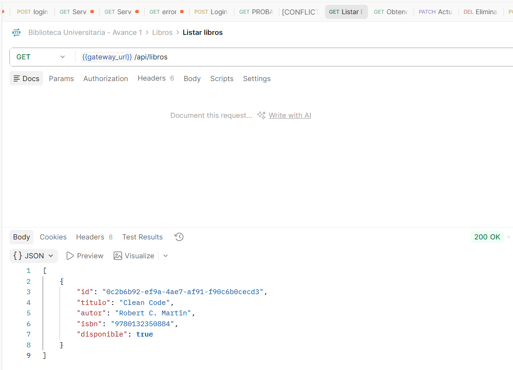
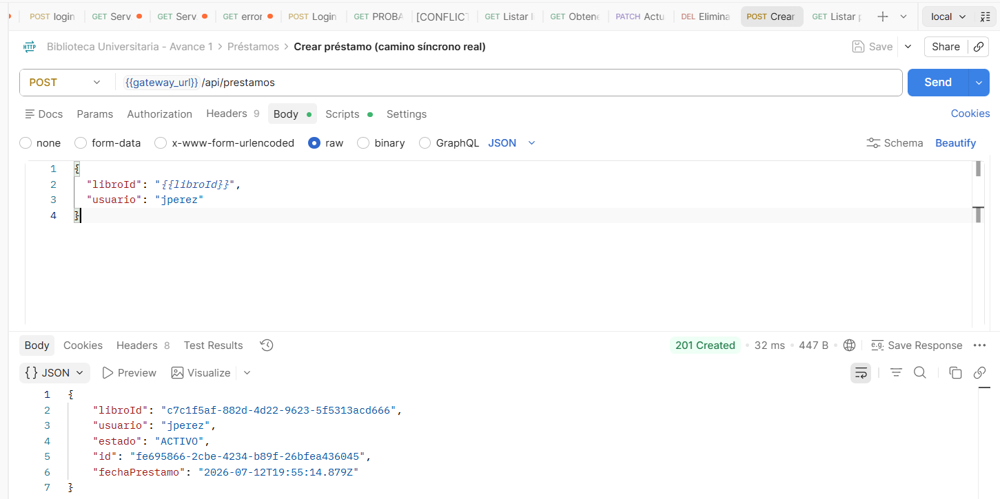
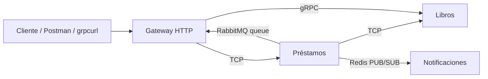

# Sistema de Gestión de Biblioteca Universitaria
> MVP de arquitectura de microservicios · Distribuidas · 7.° semestre · Entrega por avances.

## 👥 Equipo
| Integrante | Rol | GitHub |
|---|---|---|
| David Moran | Backend / Arquitectura | @usuario |
| Gabriel Vivanco | Transportes / gRPC | @usuario |
| Alison Miranda | Seguridad / Observabilidad | @usuario |
| Samir Mideros | Documentación / QA | @usuario |

## 🧩 Descripción del MVP
El sistema permite administrar el catálogo de libros de una biblioteca universitaria y los préstamos que los usuarios realizan sobre ese catálogo, generando notificaciones cuando un préstamo se registra. El dominio se mantiene deliberadamente sencillo (3 entidades: Libro, Préstamo, Notificación) para que el esfuerzo del proyecto se concentre en la **arquitectura de comunicación entre microservicios** (síncrona vs. asíncrona) y no en lógica de negocio compleja.

- **MS 1 — Libros:** administra el catálogo (crear, consultar, actualizar, eliminar, verificar disponibilidad).
- **MS 2 — Préstamos:** registra préstamos; antes de confirmar uno, consulta de forma **síncrona (TCP)** al MS Libros para verificar disponibilidad; al terminar, publica un **evento asíncrono en Redis**.
- **MS 3 — Notificaciones:** escucha el evento de Redis y simula el envío de una notificación, sin bloquear al MS Préstamos.
- **API Gateway:** punto único de entrada HTTP para el cliente; redirige al microservicio correspondiente.

## 🛠️ Stack
- **Framework:** NestJS (TypeScript)
- **Síncrono:** TCP · **Eventos:** Redis (Pub/Sub) · **RPC:** gRPC · **Mensajería:** RabbitMQ
- **BD:** PostgreSQL · **Persistencia:** TypeORM
- **Contenedores:** Docker Compose · **Estructura:** monorepo (`apps/`)
- **Control de versiones:** Git + GitHub (GitHub Flow)

> En el **Avance 1** no incluimos gRPC, JWT, RabbitMQ/MQTT/NATS ni Sentry. Esos temas se agregan en los avances siguientes.

## ▶️ Cómo ejecutar
```bash
docker compose up -d --build
docker compose ps
curl http://localhost:3000/api/libros
```
*(Este bloque se completará y verificará en los pasos de Docker Compose y CRUD.)*

## 🏗️ Arquitectura
```
Cliente
  │  HTTP
  ▼
API Gateway
  │  TCP (síncrono)
  ▼
Préstamos ───────────────► Libros
  │
  │  Redis PUBLISH (asíncrono, no bloqueante)
  ▼
Notificaciones
```
*(Diagrama de imagen para `/docs` se agregará más adelante.)*

## 🧭 Metodología
- **Kanban:** *(pendiente — se enlaza en un paso posterior)*.
- **Ramificación:** GitHub Flow — `main` protegida, ramas `feat/…`, `fix/…`, `docs/…`, PRs revisados, tag `v1-avance1` al cierre del avance.
- **Commits semánticos:** Conventional Commits (`feat`, `fix`, `docs`, `refactor`, `chore`, `ci`).

## 🗺️ Patrones y principios aplicados
*(Se documentan a medida que se implementan: API Gateway, Publisher/Subscriber, DTO+Pipes (SRP), Exception Filters, Inyección de Dependencias (DIP), etc.)*

---

## 🟢 Avance 1 — Acoplamiento temporal y latencia · `tag v1-avance1`

### Paso 1 — Estructura de carpetas del monorepo

**Qué hicimos:** creamos el esqueleto de carpetas del repositorio, sin generar aún ningún proyecto NestJS dentro:

```
PROYECTO-P3-DISTRIBUIDAS/
├── apps/
│   ├── gateway/
│   ├── libros/
│   ├── prestamos/
│   └── notificaciones/
├── docs/
│   └── evidencias/
├── docker-compose.yml
├── benchmark.js
├── README.md
├── README.plantilla.md
├── GUIA_GENERAL.md
├── TABLERO_KANBAN.md
├── TAREA_1.md
└── .gitignore
```

**Por qué lo hacemos así:**
- **Monorepo (`apps/`):** los 4 servicios (Gateway + 3 microservicios) viven en un solo repositorio pero cada uno es un proyecto NestJS **independiente** (su propio `package.json`, `Dockerfile`, `tsconfig.json`). Esto es justo lo que pide la guía del profesor y facilita que Docker Compose construya cada servicio por separado sin perder la trazabilidad de commits en un único historial de Git.
- **Carpetas vacías todavía:** en este paso solo preparamos el contenedor de carpetas. Cada carpeta dentro de `apps/` se llenará en el **Paso 2**, cuando ejecutemos `nest new` dentro de cada una — así evitamos mezclar la generación de código con la organización del repo, y si algo sale mal en un `nest new` es fácil de aislar.
- **`docs/evidencias/`:** aquí van las capturas de latencia y de la prueba de caída del microservicio, que la rúbrica exige como evidencia obligatoria (criterio C2 y C5 de `TAREA_1.md`).
- **Archivos raíz vacíos (`docker-compose.yml`, `benchmark.js`, etc.):** los dejamos creados como *placeholders* para que la estructura del repo coincida con la que espera el profesor desde el día 1, aunque su contenido real se agrega en pasos posteriores (Docker Compose en el Paso 4, benchmark en el Paso 16).

**Comandos exactos ejecutados** (puedes correrlos tal cual en tu terminal, dentro de la carpeta donde quieras crear el proyecto):
```bash
mkdir -p PROYECTO-P3-DISTRIBUIDAS/apps/gateway
mkdir -p PROYECTO-P3-DISTRIBUIDAS/apps/libros
mkdir -p PROYECTO-P3-DISTRIBUIDAS/apps/prestamos
mkdir -p PROYECTO-P3-DISTRIBUIDAS/apps/notificaciones
mkdir -p PROYECTO-P3-DISTRIBUIDAS/docs/evidencias

cd PROYECTO-P3-DISTRIBUIDAS
touch docker-compose.yml benchmark.js GUIA_GENERAL.md TABLERO_KANBAN.md TAREA_1.md README.plantilla.md .gitignore

git init
git add .
git commit -m "chore: estructura inicial del monorepo (apps/, docs/)"
```

### 📈 Latencia (con `benchmark.js`)

Se realizaron 50 peticiones para comparar el comportamiento del camino síncrono
(Gateway → Préstamos → Libros mediante TCP) frente al camino asíncrono
(Préstamos → Redis → Notificaciones).

| Comunicación | Promedio (ms) | P95 (ms) | Máximo (ms) |
|---|---:|---:|---:|
| Síncrona TCP | 9.10 | 32.56 | 48.77 |
| Asíncrona Redis Pub/Sub | 1.84 | 2.41 | 5.06 |

Resultados:
- La comunicación asíncrona presentó menor latencia debido a que el servicio de préstamos no espera la respuesta del consumidor del evento.
- La comunicación síncrona tiene mayor tiempo de respuesta porque requiere esperar la consulta TCP al microservicio Libros.





## 🧪 Pruebas funcionales con Postman

Para verificar la comunicación entre los microservicios se realizaron pruebas mediante Postman, validando tanto la comunicación síncrona mediante TCP como la comunicación asíncrona mediante Redis Pub/Sub.

---

## 1. Verificación del catálogo de libros

Primero se obtiene un libro existente desde el API Gateway para utilizar su identificador en la prueba de préstamo.

### Método:
```

GET

```

### Endpoint:
```

[http://localhost:3000/api/libros](http://localhost:3000/api/libros)

```

### Resultado esperado:

La respuesta devuelve la lista de libros disponibles con su respectivo identificador (`id`).

Ejemplo:

```json
[
    {
        "id": "c7c1f5af-882d-4d22-9623-5f5313acd666",
        "titulo": "Clean Code",
        "autor": "Robert C. Martin",
        "isbn": "9780132350884",
        "disponible": true
    }
]
```

Se copia el valor del campo `id`, ya que será utilizado en la siguiente prueba.

### Evidencia:



---

# 2. Prueba de comunicación síncrona TCP

Se realiza una solicitud para registrar un préstamo. El flujo interno utilizado es:

```
Cliente (Postman)
        |
        | HTTP
        ▼
API Gateway
        |
        | TCP Request/Response
        ▼
Microservicio Préstamos
        |
        | TCP Request/Response
        ▼
Microservicio Libros
```

El microservicio Préstamos consulta al microservicio Libros mediante TCP para verificar que el libro exista y esté disponible antes de continuar.

### Método:

```
POST
```

### Endpoint:

```
http://localhost:3000/api/prestamos/test-sync
```

### Headers:

| Key          | Value            |
| ------------ | ---------------- |
| Content-Type | application/json |

### Body:

Seleccionar:

```
Body → raw → JSON
```

Enviar:

```json
{
    "libroId": "ID_DEL_LIBRO"
}
```

Ejemplo:

```json
{
    "libroId": "c7c1f5af-882d-4d22-9623-5f5313acd666"
}
```

### Resultado esperado:

```json
{
    "libroId": "c7c1f5af-882d-4d22-9623-5f5313acd666",
    "usuario": "jperez",
    "estado": "ACTIVO",
    "id": "fe695866-2cbe-4234-b89f-26bfea436045",
    "fechaPrestamo": "2026-07-12T19:55:14.879Z"
}
```

### Evidencia:



---

# 3. Prueba de comunicación asíncrona Redis Pub/Sub

Se realiza una prueba donde el microservicio Préstamos genera un evento utilizando Redis Pub/Sub.

El flujo interno utilizado es:

```
Microservicio Préstamos
        |
        | Evento: prestamo.registrado
        ▼
Redis Pub/Sub
        |
        ▼
Microservicio Notificaciones
```

El servicio de Préstamos publica el evento sin esperar una respuesta del microservicio Notificaciones, permitiendo reducir el acoplamiento temporal.

### Método:

```
POST
```

### Endpoint:

```
http://localhost:3000/api/prestamos/test-async
```

### Body:

Seleccionar:

```
Body → raw → JSON
```

Enviar:

```json
{}
```

### Resultado esperado:

La solicitud se procesa correctamente y el evento es publicado en Redis.


### Validación en logs:

Comando utilizado:

```bash
docker compose logs prestamos --tail=30
```

Resultado esperado:

```
Evento 'prestamo.registrado' publicado
```


Luego se verifica el consumidor:

```bash
docker compose logs notificaciones --tail=30
```

Resultado esperado:

```
Evento recibido y procesado por Notificaciones
```


### 🧨 Acoplamiento temporal

El sistema presenta dos tipos de comunicación:

- Comunicación síncrona TCP:
  El microservicio Préstamos depende temporalmente del microservicio Libros, ya que debe esperar su respuesta antes de confirmar la operación.

- Comunicación asíncrona Redis Pub/Sub:
  El microservicio Préstamos publica el evento `prestamo.registrado` y continúa su ejecución sin esperar al microservicio Notificaciones.

Esto reduce el acoplamiento temporal y mejora la disponibilidad del sistema.

### Ejecución del benchmark

```bash
node benchmark.js <libroId>
```


### 🧠 Análisis

Los resultados muestran que la comunicación asíncrona mediante Redis Pub/Sub presenta una menor latencia debido a que el microservicio Préstamos no necesita esperar una respuesta del servicio Notificaciones para finalizar la operación.

En cambio, la comunicación síncrona mediante TCP presenta una mayor latencia porque existe una dependencia temporal entre Préstamos y Libros. El servicio debe enviar una solicitud y esperar la respuesta antes de continuar.

La arquitectura implementada permite utilizar cada tipo de comunicación según la necesidad del sistema:
- TCP para operaciones donde se requiere una respuesta inmediata y validación antes de continuar.
- Redis Pub/Sub para eventos donde no es necesario bloquear el flujo principal.
---

## 🟡 Avance 2 — Comunicación: gRPC + segundo transporte + excepciones · `tag v2-avance2`

### gRPC en el monorepo
Se incorporó un flujo gRPC entre el API Gateway y el microservicio de Libros. El contrato está definido en [proto/libros.proto](proto/libros.proto) y expone el método `ObtenerLibro`, con mensajes `LibroRequest` y `LibroResponse`.

El flujo queda así:

```text
Cliente → Gateway HTTP → Libros (gRPC)
```

El gateway invoca al servicio con `getService('LibrosService')` y el microservicio de Libros responde con los datos del libro o un error controlado. La lógica de negocio en [apps/libros/src/libros/libros.service.ts](apps/libros/src/libros/libros.service.ts) y [apps/gateway/src/gateway/gateway.service.ts](apps/gateway/src/gateway/gateway.service.ts) envuelve la operación con `try/catch`/`RpcException` para que un fallo no rompa el flujo completo del sistema.

### Segundo transporte: RabbitMQ
Se añadió RabbitMQ como segundo transporte de mensajería para la auditoría de préstamos. El microservicio de Préstamos publica el evento `prestamo.auditoria` y el Gateway lo consume de forma asíncrona mediante un handler `@EventPattern`, manteniendo el flujo desacoplado del camino principal.

```text
Préstamos → RabbitMQ → Gateway (auditoría)
```

Este transporte es distinto al Redis del Avance 1, que sigue usándose para eventos de negocio como `prestamo.registrado` y `prestamo.test`.

### 🔁 Comparación de transportes
| Transporte | Tipo | Patrón | Uso en el proyecto |
|---|---|---|---|
| TCP | Síncrono | Petición-respuesta | Camino principal Gateway → Préstamos → Libros |
| Redis | Asíncrono | PUB/SUB | Eventos de negocio y benchmark del Avance 1 |
| RabbitMQ | Asíncrono | Cola / eventos | Auditoría de préstamos y desacoplamiento del flujo |
| gRPC | Síncrono | Contrato/RPC | Consulta de libro por contrato `.proto` |

TCP conviene cuando se necesita una respuesta inmediata y validación; Redis y RabbitMQ son mejores para eventos asíncronos; gRPC resulta adecuado cuando ambos servicios comparten un contrato claro y estable.

### 🧯 Manejo de excepciones
Se controla el error de libro inexistente en la capa de servicios:

- En [apps/libros/src/libros/libros.service.ts](apps/libros/src/libros/libros.service.ts), `obtenerLibroGrpc()` captura la excepción y la transforma en un `RpcException` con estado `404`.
- En [apps/gateway/src/gateway/gateway.service.ts](apps/gateway/src/gateway/gateway.service.ts), `obtenerLibroGrpc()` traduce el fallo a una respuesta HTTP controlada en vez de dejar que el servicio se caiga.

Esto demuestra que un error conocido no tumba el sistema: el cliente recibe un mensaje claro de error y el servicio sigue disponible para otras operaciones.

### Evidencias y validación
Comandos útiles para validar el avance 2:

```bash
docker compose up -d --build
curl http://localhost:3000/api/libros/grpc/<id-existente>
curl -i http://localhost:3000/api/libros/grpc/<id-inexistente>
docker compose logs gateway --tail=50
```

Resultado esperado:
- La primera llamada devuelve el libro por gRPC.
- La segunda devuelve un error `404` controlado.
- Los logs del gateway muestran el evento `prestamo.auditoria` recibido desde RabbitMQ.

---

## 🔵 Avance 3 — Seguridad, observabilidad e integración (FINAL) · `tag v3-final`
### 🔐 Autenticación y autorización
✍️ <<Login que emite JWT; Guard que protege rutas. Evidencia: 200 con token, 401 sin token (y 403 por rol si aplica).>>

### 📊 Observabilidad (Sentry)
✍️ <<Qué se registra; captura del error en el panel de Sentry.>>

### 🔗 Integración final
✍️ <<Operación que atraviesa varios microservicios/transportes desde el Gateway.>>

### 🏗️ Diagrama final
✍️ <<Sistema integrado>>

---

## 🎤 Defensa
✍️ <<Enlace a diapositivas + guion. Runbook de la demo (levantar → login → ruta protegida → operación integrada → error en Sentry). Preguntas frecuentes preparadas.>>

## 🟡 Avance 2 — Comunicación: gRPC + segundo transporte + excepciones · `tag v2-avance2`

### 1) Arquitectura actualizada



### 2) Contrato gRPC

Archivo compartido del monorepo: `proto/libros.proto`

```proto
syntax = "proto3";

package biblioteca;

service LibrosService {
  rpc ObtenerLibro (LibroRequest) returns (LibroResponse);
}

message LibroRequest {
  string id = 1;
}

message LibroResponse {
  string id = 1;
  string titulo = 2;
  string autor = 3;
  string isbn = 4;
  bool disponible = 5;
}
```

**Flujo gRPC:** el Gateway consume `LibrosService/ObtenerLibro` desde el microservicio Libros. En Libros, el método de servicio encapsula el acceso a la base de datos con `try/catch` y reenvía los errores controlados como `RpcException`. En el Gateway, la llamada también usa `try/catch` para traducir fallos de red o errores de negocio a respuestas HTTP consistentes.

Ejemplo de prueba con `grpcurl`:

```bash
grpcurl -plaintext -proto proto/libros.proto -d '{"id":"ID_EXISTENTE"}' localhost:4001 biblioteca.LibrosService/ObtenerLibro
```

### 3) Segundo transporte: RabbitMQ

Se agregó un flujo asíncrono adicional para auditoría:

```text
Préstamos -> RabbitMQ queue: prestamo.auditoria -> Gateway
```

El microservicio Préstamos publica el evento `prestamo.auditoria` después de registrar un préstamo real. El Gateway lo consume y registra la auditoría sin bloquear el flujo principal. Si la publicación a RabbitMQ falla, Préstamos captura el error, lo registra y continúa con la operación principal para no tumbar el servicio.

### 4) Manejo de excepciones

- En `LibrosService.obtenerLibroGrpc(...)` se controla el caso de libro inexistente y se traduce a `RpcException`.
- En `GatewayService.obtenerLibroGrpc(...)` se convierte el error gRPC a `HttpException` para devolver un estado HTTP claro.
- En `PrestamosService.create(...)` la publicación a RabbitMQ está envuelta en `try/catch`; si el broker falla, la reserva del préstamo sigue y el servicio no cae.

### 5) Comparación de transportes

| Transporte | Tipo | Patrón | Uso en el proyecto |
|---|---|---|---|
| TCP | Síncrono | Petición-respuesta | Gateway -> Préstamos y Préstamos -> Libros para validar y ejecutar operaciones del Avance 1 |
| Redis | Asíncrono | PUB/SUB | Préstamos -> Notificaciones para `prestamo.registrado` |
| RabbitMQ | Asíncrono | Queue / mensajería | Préstamos -> Gateway para la auditoría `prestamo.auditoria` |
| gRPC | Síncrono | Contrato/RPC | Gateway -> Libros para consultar un libro con contrato `.proto` |

TCP conviene cuando necesito respuesta inmediata y control del flujo, como verificar disponibilidad antes de registrar un préstamo. Redis funciona bien para eventos livianos y desacoplados. RabbitMQ es más apropiado cuando quiero una cola más explícita para auditoría o trabajos asíncronos que deben quedar en espera. gRPC encaja cuando necesito un contrato fuerte, tipado y rápido entre servicios, sin perder la semántica de RPC.

### 6) Evidencias del Avance 2

- gRPC exitoso entre Gateway y Libros.
- gRPC con error controlado para un libro inexistente.
- Evento `prestamo.auditoria` publicado en RabbitMQ y consumido por el Gateway.
- Logs o captura del `try/catch` mostrando que el servicio no cae.

### Evidencias (capturas)

Las capturas se encuentran en la carpeta `docs/avance2/`. A continuación se listan las imágenes que subimos y una breve descripción de cada una:

- **docs/avance2/postman-create-libro.png**: Respuesta del endpoint `POST /api/libros` en Postman mostrando el libro creado y su `id` (usado en las pruebas siguientes).

- **docs/avance2/grpc-success.png**: Resultado de `GET /api/libros/grpc/:id` vía Gateway — respuesta exitosa devuelta por el microservicio `Libros` a través de gRPC.

- **docs/avance2/grpc-not-found.png**: Prueba con un `id` inexistente que demuestra el manejo de excepción: respuesta HTTP 404 controlada devuelta por el Gateway tras recibir un `RpcException` del servicio gRPC.

- **docs/avance2/prestamo-created-postman.png**: Captura de Postman donde se crea un préstamo (POST `/api/prestamos`) que dispara la publicación a RabbitMQ.

- **docs/avance2/rabbitmq-ui.png**: Panel de administración de RabbitMQ mostrando la cola `prestamo.auditoria` y los contadores de mensajes / consumidores.

- **docs/avance2/gateway-logs-auditoria.png**: Extracto de los logs del Gateway donde se muestra `Evento RabbitMQ 'prestamo.auditoria' recibido: ...`, evidenciando el consumo asíncrono.

Guarda estas imágenes en `docs/avance2/` y confirma para que ajuste los textos finales o el orden si lo deseas.

