# Sistema de Gestión de Biblioteca Universitaria

> MVP de arquitectura de microservicios · Distribuidas · 7.° semestre · Entrega por avances.

## 👥 Equipo

| Integrante | Rol | GitHub |
|---|---|---|
| David Moran | Backend / Arquitectura | @ldmoran |
| Gabriel Vivanco | Transportes / gRPC | @usuario |
| Alison Miranda | Seguridad / Observabilidad | @usuario |
| Samir Mideros | Documentación / QA | @esmid17 |

## 🧩 Descripción del MVP

El sistema permite administrar el catálogo de libros de una biblioteca universitaria y los préstamos que los usuarios realizan sobre ese catálogo, generando notificaciones cuando un préstamo se registra.

El dominio se mantiene deliberadamente sencillo (3 entidades: Libro, Préstamo, Notificación) para que el esfuerzo del proyecto se concentre en la **arquitectura de comunicación entre microservicios** (síncrona vs. asíncrona) y no en lógica de negocio compleja.

- **MS 1 — Libros:** administra el catálogo (crear, consultar, actualizar, eliminar, verificar disponibilidad).
- **MS 2 — Préstamos:** registra préstamos; antes de confirmar uno, consulta de forma **síncrona (TCP)** al MS Libros para verificar disponibilidad; al terminar, publica un **evento asíncrono en Redis**.
- **MS 3 — Notificaciones:** escucha el evento de Redis y simula el envío de una notificación, sin bloquear al MS Préstamos.
- **API Gateway:** punto único de entrada HTTP para el cliente; redirige al microservicio correspondiente.

## 🛠️ Stack

- **Framework:** NestJS (TypeScript)
- **Síncrono:** TCP · **Eventos:** Redis (Pub/Sub)
- **BD:** PostgreSQL · **Persistencia:** TypeORM
- **Contenedores:** Docker Compose · **Estructura:** monorepo (apps/)
- **Control de versiones:** Git + GitHub (GitHub Flow)

> Este avance **no incluye** gRPC, JWT, RabbitMQ/MQTT/NATS ni Sentry — esos temas corresponden a los Avances 2 y 3.

## ▶️ Ejecución del proyecto

El sistema se despliega mediante **Docker Compose**, levantando automáticamente todos los componentes de la arquitectura:

- API Gateway
- Microservicio Libros
- Microservicio Préstamos
- Microservicio Notificaciones
- PostgreSQL
- Redis

### Iniciar el sistema

```bash
docker compose up --build
```

### Verificar el estado de los contenedores

```bash
docker compose ps
```

### Acceder al Gateway

```text
http://localhost:3000
```

### Evidencia de ejecución

La siguiente captura muestra que todos los contenedores fueron creados e iniciados correctamente mediante Docker Compose.

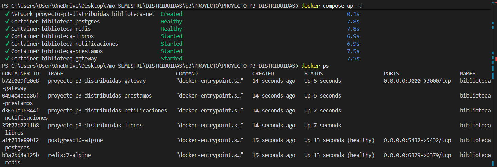

## 🏗️ Arquitectura

```
Cliente
  │  HTTP
  ▼
API Gateway
  │  TCP (síncrono)
  ▼
Préstamos ───────────────► Libros
  │
  │  Redis PUBLISH (asíncrono, no bloqueante)
  ▼
Notificaciones
```

### Diagrama de arquitectura

El siguiente diagrama representa la arquitectura implementada en el proyecto, mostrando el flujo de comunicación entre el API Gateway, los microservicios y los mecanismos de comunicación utilizados (TCP y Redis Pub/Sub).


## 🧭 Metodología

- **Kanban:** Ver archivo TABLERO_KANBAN.md, donde se registra el avance de las tareas del proyecto mediante un tablero con seguimiento por actividades.
- **Ramificación:** cada integrante trabajó sobre su propia rama personal (`alison-miranda`, `david-moran`, `gabriel-vivanco`, `samir-mideros`) partiendo de `main`. El PR #1 (`samir-mideros` → `main`) fue el primero revisado y fusionado por GitHub. Los cierres de avance se marcan con **tags anotados reales** (`git tag -a v1-avance1 <commit> -m "..."`), no con mensajes de commit como se hizo al inicio.
- **Commits:** el historial temprano usa mensajes genéricos (`update`, `first commit`); a partir de esta corrección el equipo adopta Conventional Commits (`feat`, `fix`, `docs`, `refactor`, `chore`) de forma consistente.

## 🗺️ Patrones y principios aplicados

Durante el desarrollo del proyecto se aplicaron distintos patrones de diseño y principios SOLID con el objetivo de mejorar la organización, mantenibilidad y escalabilidad de la arquitectura.

### API Gateway Pattern

Se implementó un API Gateway como punto único de entrada para las solicitudes HTTP. Este componente recibe las peticiones del cliente y las redirige al microservicio correspondiente mediante comunicación TCP, evitando que los clientes accedan directamente a los servicios internos.

### Publisher / Subscriber (Redis Pub/Sub)

Para la comunicación asíncrona se utilizó el patrón Publisher/Subscriber mediante Redis Pub/Sub. El microservicio de Préstamos publica el evento `prestamo.registrado` y el microservicio de Notificaciones lo consume de forma independiente, reduciendo el acoplamiento temporal entre ambos servicios.

### Dependency Injection

NestJS utiliza inyección de dependencias para desacoplar los componentes de la aplicación. Esto facilita las pruebas, el mantenimiento y la reutilización del código.

### Repository Pattern

La persistencia de datos se realiza mediante TypeORM, el cual implementa el patrón Repository para encapsular el acceso a la base de datos y separar la lógica de negocio de la capa de persistencia.

### Principio SRP (Single Responsibility Principle)

Cada microservicio posee una única responsabilidad:

- Libros administra el catálogo.
- Préstamos gestiona el registro de préstamos.
- Notificaciones procesa los eventos publicados.
- Gateway centraliza el acceso de los clientes.

### Principio DIP (Dependency Inversion Principle)

La comunicación entre servicios se realiza mediante interfaces proporcionadas por NestJS para TCP y Redis, evitando dependencias directas entre las implementaciones de los microservicios.

### Manejo de excepciones

Se implementaron filtros globales de excepciones (`HttpExceptionFilter` y `AllExceptionsToRpcFilter`) junto con `ValidationPipe` para validar las solicitudes y mantener un manejo consistente de errores entre el Gateway y los microservicios.

---

## 🟢 Avance 1 — Acoplamiento temporal y latencia · tag v1-avance1

### Estructura del monorepo

```
PROYECTO-P3-DISTRIBUIDAS/
├── apps/
│   ├── gateway/
│   ├── libros/
│   ├── prestamos/
│   └── notificaciones/
├── docs/
│   └── evidencias/
├── proto/
│   └── libros.proto
├── docker-compose.yml
├── docker-compose.transportes.yml
├── benchmark.js
└── README.md
```

Cada servicio dentro de `apps/` es un proyecto NestJS **independiente** (su propio `package.json`, `Dockerfile`, `tsconfig.json`), lo que permite que Docker Compose construya cada uno por separado sin perder la trazabilidad de commits en un único historial de Git. `docs/evidencias/` contiene las capturas de latencia y de la prueba de caída del microservicio que exige la rúbrica (criterios C2 y C5 de TAREA_1.md).

### 📈 Latencia (con benchmark.js)

Se realizaron 50 peticiones para comparar el comportamiento del camino síncrono (Gateway → Préstamos → Libros mediante TCP) frente al camino asíncrono (Préstamos → Redis → Notificaciones).

| Comunicación | Promedio (ms) | P95 (ms) | Máximo (ms) |
|---|---:|---:|---:|
| Síncrona TCP | 9.10 | 32.56 | 48.77 |
| Asíncrona Redis Pub/Sub | 1.84 | 2.41 | 5.06 |

Resultados:

- La comunicación asíncrona presentó menor latencia debido a que el servicio de préstamos no espera la respuesta del consumidor del evento.
- La comunicación síncrona tiene mayor tiempo de respuesta porque requiere esperar la consulta TCP al microservicio Libros.


## 🧪 Pruebas funcionales con Postman

Para verificar la comunicación entre los microservicios se realizaron pruebas mediante Postman, validando tanto la comunicación síncrona mediante TCP como la comunicación asíncrona mediante Redis Pub/Sub.

---

## 1. Verificación del catálogo de libros

Primero se obtiene un libro existente desde el API Gateway para utilizar su identificador en la prueba de préstamo.

### Método:

```
GET
```

### Endpoint:

[http://localhost:3000/api/libros](http://localhost:3000/api/libros)

### Resultado esperado:

La respuesta devuelve la lista de libros disponibles con su respectivo identificador (id). Ejemplo:

```json
[
    {
        "id": "c7c1f5af-882d-4d22-9623-5f5313acd666",
        "titulo": "Clean Code",
        "autor": "Robert C. Martin",
        "isbn": "9780132350884",
        "disponible": true
    }
]
```

Se copia el valor del campo id, ya que será utilizado en la siguiente prueba.

### Evidencia:


---

# 2. Prueba de comunicación síncrona TCP

Se realiza una solicitud para registrar un préstamo. El flujo interno utilizado es:

```
Cliente (Postman)
        |
        | HTTP
        ▼
API Gateway
        |
        | TCP Request/Response
        ▼
Microservicio Préstamos
        |
        | TCP Request/Response
        ▼
Microservicio Libros
```

El microservicio Préstamos consulta al microservicio Libros mediante TCP para verificar que el libro exista y esté disponible antes de continuar.

### Método:

```
POST
```

### Endpoint:

```
http://localhost:3000/api/prestamos/test-sync
```

### Headers:

| Key | Value |
| ------------ | ---------------- |
| Content-Type | application/json |

### Body:

Seleccionar:

```
Body → raw → JSON
```

Enviar:

```json
{
    "libroId": "ID_DEL_LIBRO"
}
```

Ejemplo:

```json
{
    "libroId": "c7c1f5af-882d-4d22-9623-5f5313acd666"
}
```

### Resultado esperado:

```json
{
    "libroId": "c7c1f5af-882d-4d22-9623-5f5313acd666",
    "usuario": "jperez",
    "estado": "ACTIVO",
    "id": "fe695866-2cbe-4234-b89f-26bfea436045",
    "fechaPrestamo": "2026-07-12T19:55:14.879Z"
}
```

### Evidencia:


---

# 3. Prueba de comunicación asíncrona Redis Pub/Sub

Se realiza una prueba donde el microservicio Préstamos genera un evento utilizando Redis Pub/Sub. El flujo interno utilizado es:

```
Microservicio Préstamos
        |
        | Evento: prestamo.registrado
        ▼
Redis Pub/Sub
        |
        ▼
Microservicio Notificaciones
```

El servicio de Préstamos publica el evento sin esperar una respuesta del microservicio Notificaciones, permitiendo reducir el acoplamiento temporal.

### Método:

```
POST
```

### Endpoint:

```
http://localhost:3000/api/prestamos/test-async
```

### Body:

Seleccionar:

```
Body → raw → JSON
```

Enviar:

```json
{}
```

### Resultado esperado:

La solicitud se procesa correctamente y el evento es publicado en Redis.


### Validación en logs:

Comando utilizado:

```bash
docker compose logs prestamos --tail=30
```

Resultado esperado:

```
Evento 'prestamo.registrado' publicado
```


Luego se verifica el consumidor:

```bash
docker compose logs notificaciones --tail=30
```

Resultado esperado:

```
Evento recibido y procesado por Notificaciones
```


### 🧨 Acoplamiento temporal

El sistema presenta dos tipos de comunicación:

- Comunicación síncrona TCP: El microservicio Préstamos depende temporalmente del microservicio Libros, ya que debe esperar su respuesta antes de confirmar la operación.
- Comunicación asíncrona Redis Pub/Sub: El microservicio Préstamos publica el evento prestamo.registrado y continúa su ejecución sin esperar al microservicio Notificaciones. Esto reduce el acoplamiento temporal y mejora la disponibilidad del sistema.

### Ejecución del benchmark

```bash
node benchmark.js <libroId>
```


### 🧠 Análisis

Los resultados muestran que la comunicación asíncrona mediante Redis Pub/Sub presenta una menor latencia debido a que el microservicio Préstamos no necesita esperar una respuesta del servicio Notificaciones para finalizar la operación.

En cambio, la comunicación síncrona mediante TCP presenta una mayor latencia porque existe una dependencia temporal entre Préstamos y Libros. El servicio debe enviar una solicitud y esperar la respuesta antes de continuar.

La arquitectura implementada permite utilizar cada tipo de comunicación según la necesidad del sistema:

- TCP para operaciones donde se requiere una respuesta inmediata y validación antes de continuar.
- Redis Pub/Sub para eventos donde no es necesario bloquear el flujo principal.

## 🧪 Prueba de caída del microservicio

Con el objetivo de evidenciar el acoplamiento temporal de la comunicación síncrona, se detuvo el microservicio **Libros** mientras el resto de la arquitectura permanecía en ejecución.

### Detener el microservicio

```bash
docker stop biblioteca-libros
docker compose ps
```

### Evidencia

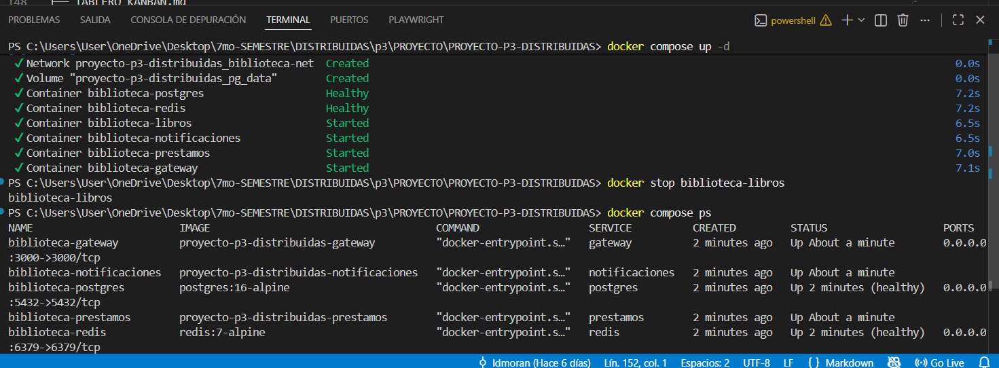

Al intentar registrar un préstamo, el Gateway y el microservicio de Préstamos no pudieron establecer comunicación con Libros, obteniéndose el siguiente error:

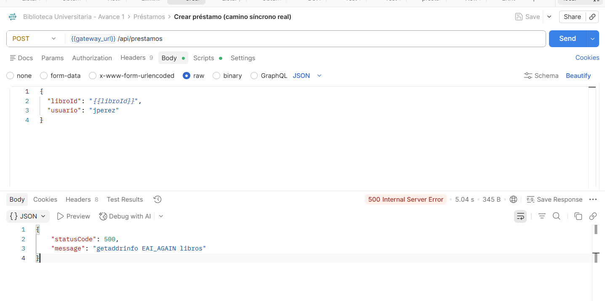

Una vez iniciado nuevamente el microservicio:

```bash
docker start biblioteca-libros
```

la operación volvió a ejecutarse correctamente.

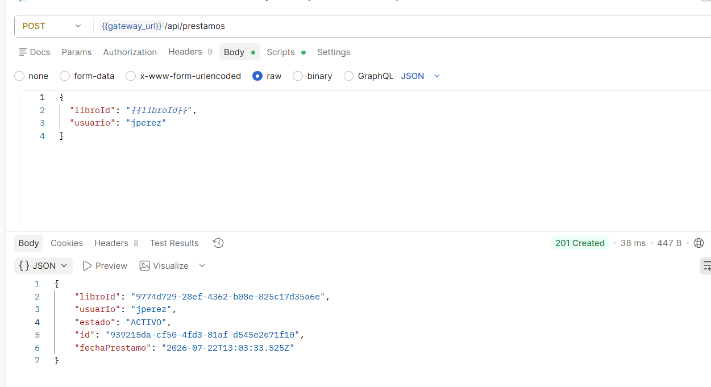

### Análisis

La prueba evidencia el **acoplamiento temporal** de la comunicación síncrona mediante TCP. El microservicio **Préstamos** depende de que el microservicio **Libros** esté disponible para completar la validación y registrar un préstamo. Cuando **Libros** se encuentra detenido, la solicitud falla porque no es posible establecer la comunicación entre ambos servicios. Una vez reiniciado el microservicio, la operación vuelve a ejecutarse correctamente, demostrando que el funcionamiento del flujo depende de la disponibilidad del servicio remoto.

---

## 🟡 Avance 2 — Comunicación: gRPC + segundo transporte + excepciones · `tag v2-avance2`

### 1) Ejecución del stack de Avance 2

Se agrega RabbitMQ y el puerto gRPC de Libros, así que se levanta con su propio archivo Compose (incluye Postgres, Redis y RabbitMQ con healthchecks reales):

```bash
docker compose -f docker-compose.transportes.yml up --build
```

### 2) Arquitectura actualizada

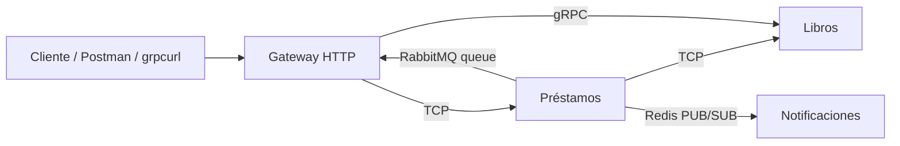

### 3) Contrato gRPC

Archivo compartido del monorepo: `proto/libros.proto`

```proto
syntax = "proto3";

package biblioteca;

service LibrosService {
  rpc ObtenerLibro (LibroRequest) returns (LibroResponse);
}

message LibroRequest {
  string id = 1;
}

message LibroResponse {
  string id = 1;
  string titulo = 2;
  string autor = 3;
  string isbn = 4;
  bool disponible = 5;
}
```

**Flujo gRPC:** el Gateway consume `LibrosService/ObtenerLibro` desde el microservicio Libros. En Libros, el método de servicio encapsula el acceso a la base de datos con `try/catch` y reenvía los errores controlados como `RpcException`. En el Gateway, la llamada también usa `try/catch` para traducir fallos de red o errores de negocio a respuestas HTTP consistentes.

Ejemplo de prueba con `grpcurl`:

```bash
grpcurl -plaintext -proto proto/libros.proto -d '{"id":"ID_EXISTENTE"}' localhost:4001 biblioteca.LibrosService/ObtenerLibro
```

### 4) RabbitMQ

Se agregó un flujo asíncrono adicional para auditoría:

```text
Préstamos -> RabbitMQ queue: prestamo.auditoria -> Gateway
```

El microservicio Préstamos publica el evento `prestamo.auditoria` después de registrar un préstamo real. El Gateway lo consume y registra la auditoría sin bloquear el flujo principal. Si la publicación a RabbitMQ falla, Préstamos captura el error, lo registra y continúa con la operación principal para no tumbar el servicio.

### 5) Manejo de excepciones

- En `LibrosService.obtenerLibroGrpc(...)` se controla el caso de libro inexistente y se traduce a `RpcException`.
- En `GatewayService.obtenerLibroGrpc(...)` se convierte el error gRPC a `HttpException` para devolver un estado HTTP claro.
- En `PrestamosService.create(...)` la publicación a RabbitMQ está envuelta en `try/catch`; si el broker falla, la reserva del préstamo sigue y el servicio no cae.

### 6) Comparación de transportes

| Transporte | Tipo | Patrón | Uso en el proyecto |
|---|---|---|---|
| TCP | Síncrono | Petición-respuesta | Gateway -> Préstamos y Préstamos -> Libros para validar y ejecutar operaciones del Avance 1 |
| Redis | Asíncrono | PUB/SUB | Préstamos -> Notificaciones para `prestamo.registrado` |
| RabbitMQ | Asíncrono | Queue / mensajería | Préstamos -> Gateway para la auditoría `prestamo.auditoria` |
| gRPC | Síncrono | Contrato/RPC | Gateway -> Libros para consultar un libro con contrato `.proto` |

TCP conviene cuando necesito respuesta inmediata y control del flujo, como verificar disponibilidad antes de registrar un préstamo. Redis funciona bien para eventos livianos y desacoplados. RabbitMQ es más apropiado cuando quiero una cola más explícita para auditoría o trabajos asíncronos que deben quedar en espera. gRPC encaja cuando necesito un contrato fuerte, tipado y rápido entre servicios, sin perder la semántica de RPC.

### 7) Evidencias del Avance 2


#### Crear libro (Postman)
Respuesta `201 Created` al crear un libro; se muestra el `id` que se usa en las siguientes pruebas.

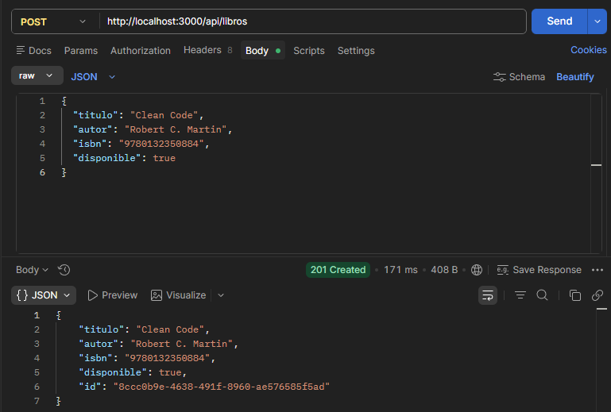

#### Consulta gRPC exitosa (Gateway → Libros)
`GET /api/libros/grpc/:id` devuelve el registro del libro vía gRPC.

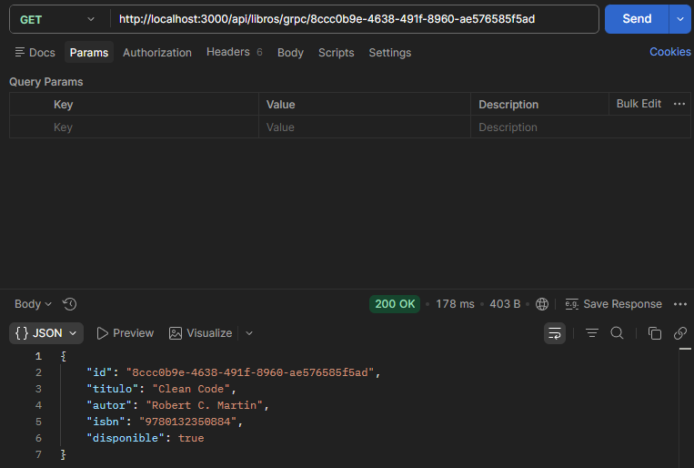

#### gRPC — libro inexistente (manejo de excepción)
Prueba con un `id` inválido; el Gateway devuelve un error controlado indicando que el libro no fue encontrado.

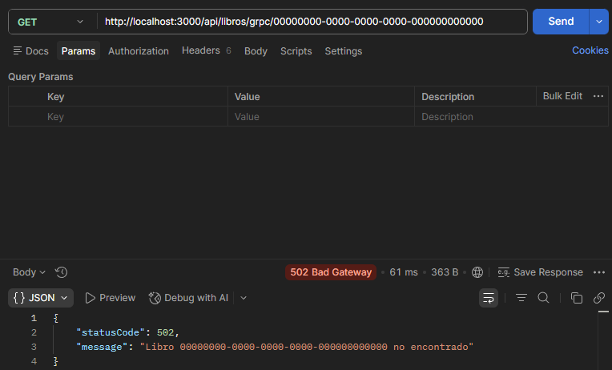

#### Crear préstamo (Postman)
`POST /api/prestamos` crea el préstamo y dispara la publicación a RabbitMQ (respuesta `201 Created`).

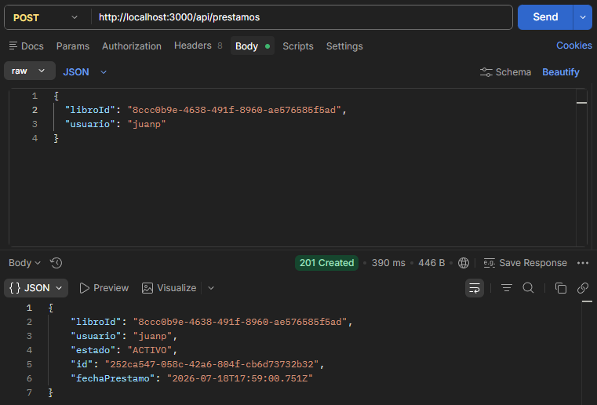

#### Logs del Gateway (inicio y rutas)
Extracto del terminal con el arranque del Gateway y el mapeo de rutas expuestas.

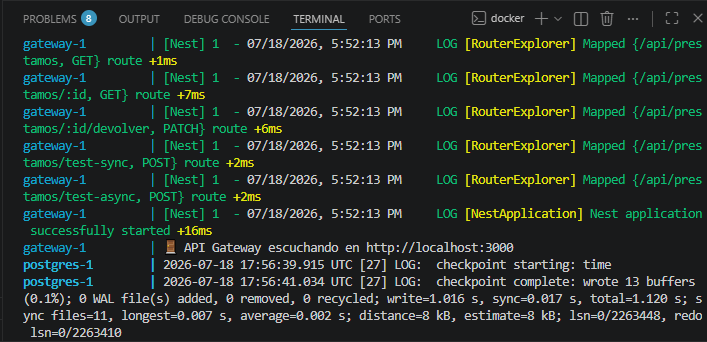

#### RabbitMQ — Queues
Panel de administración mostrando la cola `prestamo.auditoria` (mensajes y consumidores).

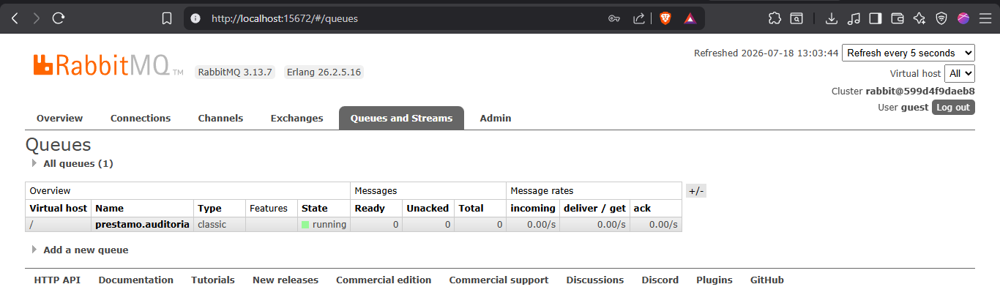

#### Contenedores (Docker)
Vista de los contenedores en Docker mostrando que los servicios están corriendo.

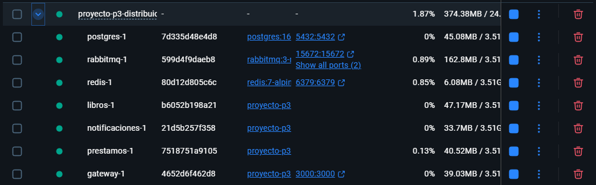

#### Logs RabbitMQ
Extracto de logs del contenedor `rabbitmq` durante el arranque.

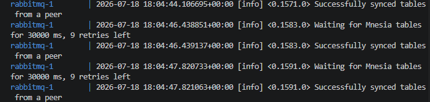

## 🔵 Avance 3 — Seguridad, observabilidad e integración (FINAL) · `tag v3-final`
### 🔐 Autenticación y autorización
✍️ <<Login que emite JWT; Guard que protege rutas. Evidencia: 200 con token, 401 sin token (y 403 por rol si aplica).>>

### 📊 Observabilidad (Sentry)
✍️ <<Qué se registra; captura del error en el panel de Sentry.>>

### 🔗 Integración final
✍️ <<Operación que atraviesa varios microservicios/transportes desde el Gateway.>>

### 🏗️ Diagrama final
✍️ <<Sistema integrado>>

---

## 🎤 Defensa
✍️ <<Enlace a diapositivas + guion. Runbook de la demo (levantar → login → ruta protegida → operación integrada → error en Sentry). Preguntas frecuentes preparadas.>>
