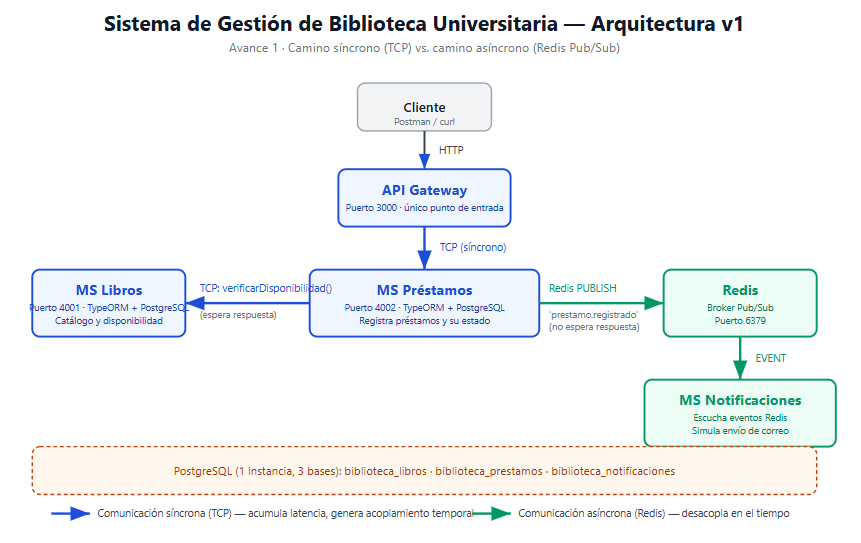

# Tablero Kanban — Proyecto de Microservicios

## Cómo crearlo en GitHub Projects (5 min)
1. Repo → pestaña **Projects** → **New project** → plantilla **Board**.
2. Columnas: **Backlog · Por hacer · En progreso · En revisión · Hecho**.
3. Creen las tarjetas de abajo. A cada una: **responsable** + etiqueta de avance (`avance-1/2/3`).
4. Muevan las tarjetas conforme avanzan. Al cerrar cada avance suban **una captura** a `/docs` y enlácenla en el README.

> Si no usan GitHub Projects, usen la tabla Markdown del final como tablero dentro del repo.

---

## Tarjetas iniciales

### 🟢 Avance 1 — `avance-1`
- [x] Definir dominio del MVP (3 microservicios + Gateway) → Sistema de Gestión de Biblioteca Universitaria
- [ ] Crear repo, proteger `main`, ramas base
- [x] Docker Compose base (Gateway + 3 MS + Redis + Postgres)
- [x] MS 1, MS 2, MS 3 (CRUD mínimo + persistencia TypeORM) → Libros, Préstamos, Notificaciones
- [x] API Gateway (entrada HTTP)
- [x] Camino síncrono con TCP (cadena Gateway→Préstamos→Libros)
- [x] Camino asíncrono con Redis (evento `prestamo.registrado`, emisor no bloquea)
- [x] Manejo de excepciones en la capa de servicios (filtros RPC/HTTP)
- [x] Benchmark de latencia (prom/p95/máx) — `benchmark.js` corrido con éxito
- [x] Prueba de acoplamiento temporal (tumbar `libros`)
- [x] Diagrama de arquitectura v1 + README Avance 1

- [x] Tag `v1-avance1` (tag anotado real: `git tag -a v1-avance1 a17c1ad`)

### 🟡 Avance 2 — `avance-2`
- [x] Definir contrato `.proto` (gRPC) entre dos microservicios
- [x] Implementar comunicación gRPC en el monorepo
- [x] try/catch para controlar errores en gRPC
- [x] Agregar segundo transporte (RabbitMQ/MQTT/NATS) con PUB/SUB o queue
- [x] Demostrar error controlado sin caída del servicio
- [x] Tabla comparativa de transportes
- [x] Diagrama actualizado + README Avance 2
- [x] Tag `v2-avance2` (tag anotado real: `git tag -a v2-avance2 c4a87a0`)

### 🔵 Avance 3 — `avance-3`
- [ ] Login que emite token JWT
- [ ] Validación del JWT en las rutas
- [ ] Guard que protege rutas (401 sin token; 403 por rol si aplica)
- [ ] Integrar logs con Sentry (capturar errores)
- [ ] Integrar todos los microservicios/transportes en una operación
- [ ] Diagrama final + README Avance 3 + sección Defensa
- [ ] Preparar diapositivas y ensayar demo
- [ ] Tag `v3-final`

---

## Tablero Markdown (alternativa dentro del repo)
| Backlog | Por hacer | En progreso | En revisión | Hecho |
|---|---|---|---|---|
| Integrar Sentry | Crear repo + proteger `main` | — | — | Dominio del MVP |
| JWT + Guard | Tag `v1-avance1` | — | — | Docker Compose base |
| Contrato gRPC | — | — | — | MS Libros / Préstamos / Notificaciones |
| Segundo transporte | — | — | — | API Gateway |
| ... | ... | ... | ... | Camino síncrono TCP |
| ... | ... | ... | ... | Camino asíncrono Redis |
| ... | ... | ... | ... | Manejo de excepciones |
| ... | ... | ... | ... | Benchmark de latencia |
| ... | ... | ... | ... | Prueba de acoplamiento temporal |
| ... | ... | ... | ... | Diagrama de arquitectura v1 |