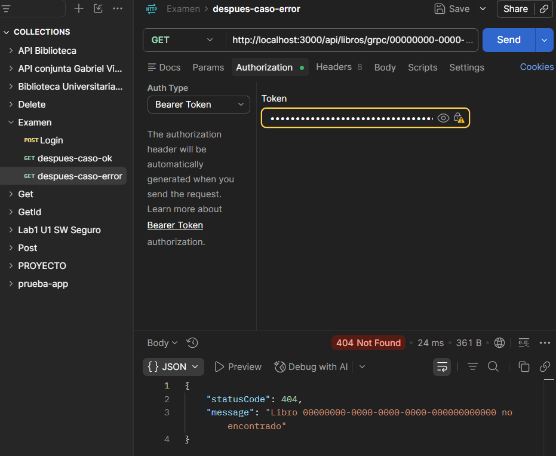

== Caso error: libro inexistente ==
HTTP/1.1 404 Not Found
X-Powered-By: Express
Access-Control-Allow-Origin: *
Content-Type: application/json; charset=utf-8
Content-Length: 87
ETag: W/"57-n2roy8V5AVlYGoUAl8dSm3DidKs"
Date: Mon, 27 Jul 2026 13:17:16 GMT
Connection: keep-alive
Keep-Alive: timeout=5

{"statusCode":404,"message":"Libro 00000000-0000-0000-0000-000000000000 no encontrado"}

