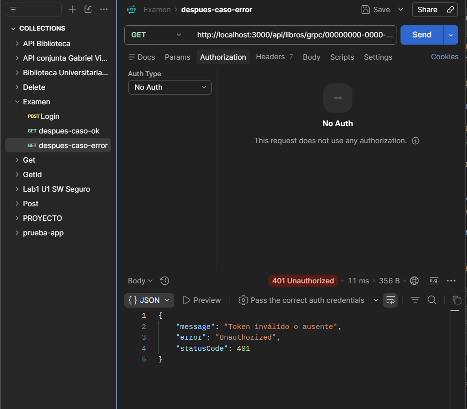

== Caso borde: sin token (no debe permitir consultar anonimamente) ==
HTTP/1.1 401 Unauthorized
X-Powered-By: Express
Access-Control-Allow-Origin: *
Content-Type: application/json; charset=utf-8
Content-Length: 79
ETag: W/"4f-x8FaXI/Ve7V9IJXfBGhDe/w8B4I"
Date: Mon, 27 Jul 2026 13:17:33 GMT
Connection: keep-alive
Keep-Alive: timeout=5

{"message":"Token inválido o ausente","error":"Unauthorized","statusCode":401}

