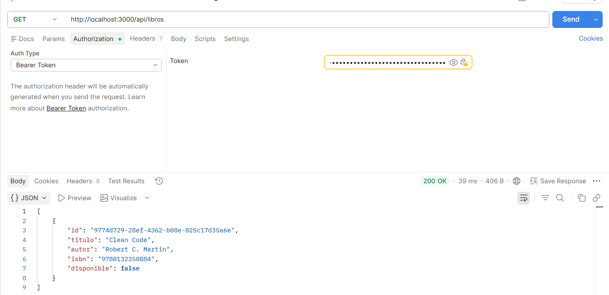
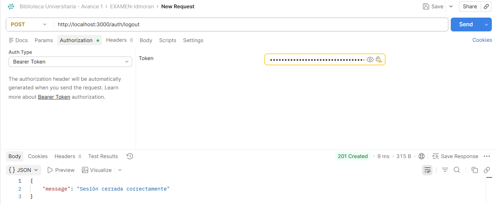
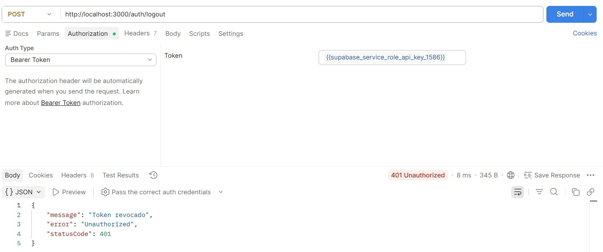
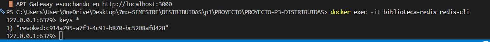
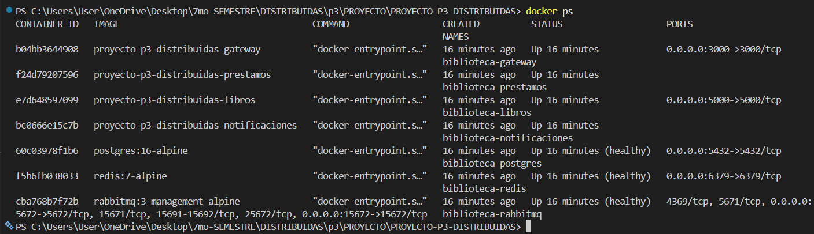
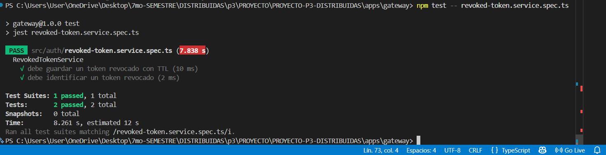

# Bitácora — Examen Final

## 0. Identificación

| | |
|---|---|
| **Nombre** | David Moran |
| **Usuario GitHub** | @ldmoran |
| **Grupo / Proyecto** | Grupo 5 — Biblioteca (P3-Distribuidas) |
| **Actividad asignada** | A — Revocación de sesión JWT (logout real) |
| **Rama** | `exam/ldmoran` |
| **Tag** | `examen-ldmoran` |
| **Pull Request** | Pendiente de creación |
| **Tarjeta Kanban** | Pendiente de creación |
| **¿Hiciste el Paso 0?** | No — la base JWT ya existía en el Gateway del proyecto |

---

# 1. Qué construí

Implementé un mecanismo de revocación de sesiones JWT para el API Gateway del sistema de biblioteca.  
Ahora los tokens JWT cuentan con un identificador único (`jti`) que permite identificar cada sesión de manera individual.  
Se agregó el proceso de logout, donde el token utilizado se registra como revocado en Redis hasta que expire naturalmente.  
Además, el guard de autenticación consulta la lista de tokens revocados antes de permitir acceso a rutas protegidas, evitando que un token cerrado pueda seguir siendo utilizado.

---

# 2. Anclaje con el repositorio de mi grupo — obligatorio (C2)

| Código preexistente | Archivo:línea | Cómo me conecto con él |
|---|---|---|
| Servicio de autenticación JWT existente | `gateway/src/auth/auth.service.ts:13` | Utilicé el flujo de autenticación existente para trabajar con el identificador único `jti` del token y mantener la compatibilidad con la generación actual de JWT. |
| Guard de autenticación JWT existente | `gateway/src/auth/jwt-auth.guard.ts:4` | Extendí el guard existente agregando la validación de tokens revocados en Redis antes de permitir acceso a rutas protegidas. |
| Servicio Redis definido en la arquitectura del proyecto | `docker-compose.yml:22` | Reutilicé la instancia Redis existente del sistema distribuido para almacenar los identificadores de tokens revocados con tiempo de expiración (TTL). |

### ¿Qué convención del repositorio seguí para que mi código no desentone?

Seguí la estructura modular existente de NestJS, manteniendo la lógica de autenticación dentro del módulo Auth y reutilizando los servicios, guards y configuraciones existentes del Gateway. La implementación mantiene el mismo estilo de organización del proyecto sin crear componentes paralelos.

### ¿Qué NO dupliqué, pudiendo hacerlo?

No creé un nuevo sistema de autenticación ni un nuevo guard JWT. La solución se integró sobre el flujo existente del Gateway, agregando únicamente la lógica necesaria para consultar Redis y rechazar tokens que fueron revocados mediante logout.

---

# 3. Decisiones técnicas

## Decisión 1

- **Qué decidí:**  
  Utilizar Redis como almacenamiento de tokens JWT revocados.

- **Alternativa que descarté:**  
  Guardar los identificadores de tokens revocados en memoria dentro del Gateway.

- **Por qué:**  
  Redis permite compartir el estado entre diferentes instancias del servicio y mantiene la arquitectura distribuida del proyecto. Un almacenamiento en memoria podría perder información al reiniciar el servicio o generar inconsistencias entre instancias.

---

## Decisión 2

- **Qué decidí:**  
  Aplicar un TTL a cada token revocado equivalente al tiempo restante de vida del JWT.

- **Alternativa que descarté:**  
  Guardar los tokens revocados permanentemente en Redis.

- **Por qué:**  
  Un token expirado ya no representa un riesgo, por lo que mantener información de revocación después de su expiración generaría almacenamiento innecesario.

---

# 4. Las 3 preguntas de mi actividad

## Pregunta 1:

> ¿Por qué el TTL de la entrada de revocación debe coincidir con la expiración del token, en vez de guardarla para siempre?

El TTL debe coincidir con la expiración del token porque después de ese momento el JWT ya no puede ser utilizado correctamente. Mantener registros de tokens expirados ocuparía espacio innecesario en Redis sin aportar una mejora adicional de seguridad.

---

## Pregunta 2:

> Si el almacén de revocados (Redis) está caído cuando llega una petición: ¿tu guard falla abierto (deja pasar) o falla cerrado (rechaza)? ¿Cuál elegiste y qué riesgo aceptas con esa decisión?

La implementación debe fallar cerrado, rechazando la petición cuando no pueda verificar la existencia del token en la lista de revocados.  
La razón es que permitir el acceso sin consultar Redis podría aceptar tokens que fueron cerrados previamente. El riesgo aceptado es una posible indisponibilidad temporal mientras Redis no esté disponible.

---

## Pregunta 3:

> ¿En qué se diferencia esto de simplemente borrar el token en el navegador del cliente?

Eliminar el token del navegador solamente evita que ese cliente lo utilice nuevamente, pero no invalida el JWT en el servidor. Si otra persona obtiene una copia del token puede seguir utilizándolo hasta su expiración.  
La revocación mediante Redis permite invalidar el token directamente desde el servidor.

---

# 5. Uso de Inteligencia Artificial — obligatorio

**¿Usaste IA en este examen?** ☒ Sí ☐ No

| # | Qué le pedí | Qué me devolvió | Qué corregí, adapté o descarté — y por qué |
|---|---|---|---|
| 1 | Revisar errores de conexión entre Gateway, Redis y RabbitMQ durante el despliegue con Docker Compose. | Recomendaciones sobre revisar nombres de servicios, variables de entorno y conexiones internas de Docker. | Adapté las soluciones a la estructura real del docker-compose del proyecto. |
| 2 | Revisar cómo implementar logout real con JWT y Redis. | Sugirió utilizar el identificador `jti` del JWT y almacenar tokens revocados con TTL. | Se ajustó la implementación al AuthModule y Guard ya existentes del proyecto. |
| 3 | Revisar la documentación requerida para el examen final. | Ayudó a organizar evidencias, bitácora y estructura de entrega. | Se adaptó la documentación según los archivos y funcionamiento real del repositorio. |

---

## ¿En qué se equivocó respecto a mi repositorio?

La IA no tenía conocimiento directo del repositorio del grupo, por lo que algunas sugerencias iniciales asumían estructuras diferentes de carpetas o servicios.  
Las recomendaciones fueron verificadas contra el código existente antes de aplicarlas, manteniendo las convenciones utilizadas por el proyecto.

---

# 6. Evidencia

| Archivo | Qué demuestra |
|---|---|
| `antes-ruta-protegida-200.png` | Una ruta protegida funcionando correctamente antes de revocar el token. |
| `despues-logout-200.png` | El endpoint `/auth/logout` ejecutando correctamente la revocación del token. |
| `despues-ruta-protegida-401.png` | La misma petición utilizando el mismo token después del logout devuelve 401. |
| `redis-revoked-key.png` | Evidencia de que Redis almacena el identificador del token revocado. |

---

## Cómo reproducir mi cambio desde cero:
----
docker compose up --build

docker exec -it biblioteca-redis redis-cli
----

# Capturas de pantalla

 ## 1) antes-ruta-protegida-200.png
 ## ¿Qué demuestra?

Que antes del logout el token funciona.


## 2) despues-logout-201.png
¿Qué demuestra?

Que el logout funciona y guarda el token como revocado.



## 3) despues-ruta-protegida-401.png

Esta es la más importante.

Usa EXACTAMENTE el mismo token anterior.



## 4) redis-revocados.png (extra para subir calidad)

Esta no la pide explícitamente pero ayuda bastante para C5.




## 5) Captura del docker funcionando

----
docker ps
----




# 7. Prueba automatizada

| | |
|---|---|
| **Archivo de la prueba** | `src/auth/revoked-token.service.spec.ts` |
| **Comando para ejecutarla** | `npm test -- revoked-token.service.spec.ts` |
| **Qué verifica** | Verifica que el servicio almacene un token revocado en Redis con TTL y que pueda identificar correctamente un token que ya fue revocado. |
| **¿Falla sin mi cambio?** | Sí — antes de implementar la lógica de revocación los tokens podían continuar siendo utilizados después del logout. |



```bash
PASS src/auth/revoked-token.service.spec.ts

RevokedTokenService
✓ debe guardar un token revocado con TTL
✓ debe identificar un token revocado

Test Suites: 1 passed, 1 total
Tests: 2 passed, 2 total
```

# 8. Estado final — honesto

## Funciona:

* Generación y uso de JWT con identificador único.
* Logout protegido mediante token válido.
* Registro de tokens revocados en Redis.
* Rechazo de tokens revocados mediante el Guard.
* Despliegue completo mediante Docker Compose.

## No funciona / quedó incompleto:

* Pendiente agregar la prueba automatizada solicitada por el examen.
* Pendiente completar enlaces de Pull Request y Kanban.

## Cuál era mi siguiente paso:

Implementar la prueba automatizada del Guard JWT y completar la documentación final del repositorio.

---

# 9. Declaración

Declaro que este trabajo es individual, que corresponde a la actividad que me fue asignada, y que la sección 5 refleja de forma completa y veraz el uso que hice de herramientas de Inteligencia Artificial durante el examen.

**Nombre:** David Moran

**Fecha:** 27/07/2026


